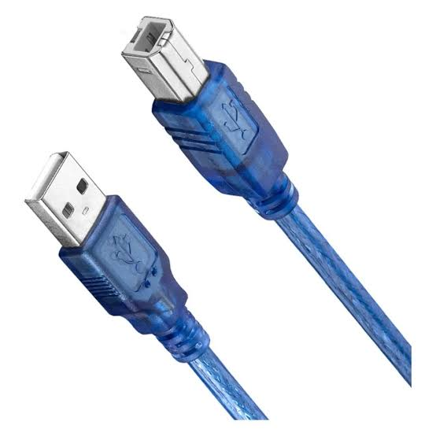

# Arduino
# Semana 2 y 3 

**Arduino**
 
Arduino es una plataforma electrónica de código abierto compuesta por una placa programable y un programa llamado Arduino IDE. Su principal objetivo es facilitar la creación de proyectos relacionados con la electrónica, la programación y la robótica.

La placa Arduino contiene un microcontrolador, el cual funciona como el “cerebro” del circuito. Este componente recibe información por medio de sus entradas, procesa las instrucciones del programa y genera una respuesta mediante sus salidas. Por ejemplo, Arduino puede detectar cuando se presiona un botón y, como respuesta, encender un LED, mover un motor o activar una alarma. (Educ.ar, 2021)

**¿Cómo se utiliza Arduino?**

1. Conectar la placa Arduino a la computadora mediante un cable USB.
2. Abrir el programa Arduino IDE.
3. Seleccionar **Herramientas > Placa > Arduino Uno**.
4. Seleccionar el puerto donde está conectado el Arduino.
5. Escribir o pegar el código del circuito.
6. Presionar el botón de verificación para revisar errores.
7. Presionar el botón de carga para enviar el código al Arduino.
8. Comprobar que el circuito funcione correctamente.

[Sitio de información][info1]
[Sitio de información][info2]

[info2]: https://intef.es/observatorio_tecno/arduino-tecnologia-y-creatividad-en-tus-manos/
[info1]: https://www.educ.ar/recursos/156851/conoce-arduino-una-introduccion-a-la-programacion-y-la-robot

Materiales utilizados 

| Material | Cantidad | Descripción |
|:---------|:--------:|:------------|
| Arduino Uno | 1 | Es la placa principal que recibe y ejecuta el código de cada circuito. |
| Protoboard | 1 | Permite conectar los componentes sin tener que soldarlos. |
| Cable USB tipo A-B | 1 | Conecta el Arduino a la computadora, proporciona energía y permite cargar el código. |
| Cables jumper | Varios | Se utilizan para realizar las conexiones entre el Arduino, la protoboard y los demás componentes. |
| LEDs rojos | 5 o más | Emiten luz cuando reciben corriente eléctrica y sirven como indicadores visuales. |
| Resistencias de 220 Ω o 330 Ω | Varias | Limitan la corriente que reciben los LEDs para evitar que se dañen. |
| Resistencias de 10 kΩ | 2 | Mantienen estable la señal de entrada de los botones y evitan lecturas incorrectas. |
| Botones pulsadores | 2 | Funcionan como interruptores momentáneos y envían una señal cuando son presionados. |
| Potenciómetro | 1 | Es una resistencia variable. Al girar su perilla cambia el valor de la señal que recibe el Arduino. |
| Microservomotor SG90 | 1 | Es un motor pequeño cuyo ángulo puede controlarse mediante una señal enviada por Arduino. |
| Display digital de 7 segmentos | 1 | Está formado por siete pequeños segmentos luminosos que permiten mostrar números del 0 al 9. |

---
## Arduino Uno

El Arduino Uno es la placa principal de los circuitos. Recibe las señales de entrada, ejecuta el código y controla los componentes conectados a sus pines.

<em>Figura 1. Placa Arduino Uno utilizada en los circuitos.</em>

## Protoboard

La protoboard es una placa de pruebas que permite conectar componentes electrónicos sin soldarlos. Sus orificios internos están unidos en grupos para facilitar las conexiones.

<em>Figura 2. Protoboard utilizada para montar los circuitos.</em>

## Cable USB tipo A-B

Este cable conecta el Arduino Uno con la computadora. Sirve para alimentar la placa y cargar los programas realizados en Arduino IDE.

<em>Figura 3. Cable USB utilizado para conectar el Arduino.</em>

## Cables jumper

Los cables jumper permiten unir los pines del Arduino con los componentes colocados en la protoboard. Se utilizaron cables de diferentes colores para distinguir las conexiones.

<em>Figura 4. Cables jumper utilizados en las conexiones.</em>

## LEDs

Los LEDs son diodos que producen luz cuando la corriente circula en la dirección correcta. La pata larga es el positivo o ánodo y la corta es el negativo o cátodo.

<em>Figura 5. LEDs utilizados como indicadores visuales.</em>

## Resistencias

Las resistencias limitan el paso de corriente eléctrica. Las de 220 Ω o 330 Ω protegen los LEDs, mientras que las de 10 kΩ ayudan a mantener estable la lectura de los botones.

<em>Figura 6. Resistencias utilizadas en los circuitos.</em>

## Botones pulsadores

Los botones pulsadores funcionan como interruptores momentáneos. Cuando se presionan cierran el circuito y envían una señal al Arduino; al soltarlos regresan a su estado original.

<em>Figura 7. Botones pulsadores utilizados como entradas.</em>

## Potenciómetro

El potenciómetro es una resistencia variable de tres terminales. Al girar su perilla cambia el voltaje de salida, permitiendo controlar valores como la posición del servomotor.

<em>Figura 8. Potenciómetro utilizado para controlar el servomotor.</em>

## Microservomotor SG90

El microservomotor SG90 es un motor pequeño que puede colocarse en diferentes ángulos. Cuenta con tres conexiones: alimentación, tierra y señal de control.

<em>Figura 9. Microservomotor utilizado en uno de los circuitos.</em>

## Display digital de 7 segmentos

El display de 7 segmentos está formado por siete secciones luminosas identificadas con las letras de la **A** a la **G**. Arduino enciende diferentes combinaciones de segmentos para representar los números del 0 al 9. Algunos modelos también incluyen un punto decimal.

<em>Figura 10. Display digital de 7 segmentos.</em>

----

## 1_Arduino Básico Salidas Digitales

# Descripción

En esta primera sección se trabajó con las salidas digitales del Arduino. Estas salidas permiten enviar señales de encendido y apagado para controlar componentes como LEDs y el display de 7 segmentos. Los circuitos de este apartado van del número 0 al 9.

---

## Circuito 0

<em>Imagen del circuito 0 realizado en Tinkercad junto con su código.</em>

<video width="700" controls>
  <source src="{{ '/assets/videos/03-arduino/video 0 y 1.mp4' | relative_url }}" type="video/mp4">
</video>

<em>Imagen y video de la elaboración física del circuito 0.</em>

---

## Circuito 1

<em>Imagen del circuito 1 realizado en Tinkercad junto con su código.</em>

<video width="700" controls>
  <source src="{{ '/assets/videos/03-arduino/video 0 y 1.mp4' | relative_url }}" type="video/mp4">
</video>

<em>Imagen y video de la elaboración física del circuito 1.</em>

---

## Circuito 2

<em>Imagen del circuito 2 realizado en Tinkercad junto con su código.</em>

<video width="700" controls>
  <source src="{{ '/assets/videos/03-arduino/video 2 y 3.mp4' | relative_url }}" type="video/mp4">
</video>

<em>Imagen y video de la elaboración física del circuito 2.</em>

---

## Circuito 3

<em>Imagen del circuito 3 realizado en Tinkercad junto con su código.</em>

<video width="700" controls>
  <source src="{{ '/assets/videos/03-arduino/video 2 y 3.mp4' | relative_url }}" type="video/mp4">
</video>

<em>Imagen y video de la elaboración física del circuito 3.</em>

---

## Circuito 4

<em>Imagen del circuito 4 realizado en Tinkercad junto con su código.</em>

<video width="700" controls>
  <source src="{{ '/assets/videos/03-arduino/video 4.mp4' | relative_url }}" type="video/mp4">
</video>

<em>Imagen y video de la elaboración física del circuito 4.</em>

---

## Circuito 5

<em>Imagen del circuito 5 realizado en Tinkercad junto con su código.</em>

<video width="700" controls>
  <source src="{{ '/assets/videos/03-arduino/video 5.mp4' | relative_url }}" type="video/mp4">
</video>

<em>Imagen y video de la elaboración física del circuito 5.</em>

---

## Circuito 6

<em>Imagen del circuito 6 realizado en Tinkercad junto con su código.</em>

<video width="700" controls>
  <source src="{{ '/assets/videos/03-arduino/video 6.mp4' | relative_url }}" type="video/mp4">
</video>

<em>Imagen y video de la elaboración física del circuito 6.</em>

---

## Circuito 7

<em>Imagen del circuito 7 realizado en Tinkercad junto con su código.</em>

<video width="700" controls>
  <source src="{{ '/assets/videos/03-arduino/video 7.mp4' | relative_url }}" type="video/mp4">
</video>

<em>Imagen y video de la elaboración física del circuito 7.</em>

---

## Circuito 8

<em>Imagen del circuito 8 realizado en Tinkercad junto con su código.</em>

<video width="700" controls>
  <source src="{{ '/assets/videos/03-arduino/video 8.mp4' | relative_url }}" type="video/mp4">
</video>

<em>Imagen y video de la elaboración física del circuito 8.</em>

---

## Circuito 9

<em>Imagen del circuito 9 realizado en Tinkercad junto con su código.</em>

<video width="700" controls>
  <source src="{{ '/assets/videos/03-arduino/video 9.mp4' | relative_url }}" type="video/mp4">
</video>

<em>Imagen y video de la elaboración física del circuito 9.</em>

---

## 2_Arduino Básico: Entradas Digitales

# Descripción

En esta sección se utilizaron las entradas digitales del Arduino. Estas entradas reciben información de componentes como los botones pulsadores. Dependiendo de la señal recibida, Arduino puede encender o apagar diferentes LEDs. Los circuitos de este apartado van del número 10 al 16.

---

## Circuito 10

<em>Imagen del circuito 10 realizado en Tinkercad junto con su código.</em>

<video width="700" controls>
  <source src="{{ '/assets/videos/03-arduino/video 10.mp4' | relative_url }}" type="video/mp4">
</video>

<em>Imagen y video de la elaboración física del circuito 10.</em>

---

## Circuito 11

<em>Imagen del circuito 11 realizado en Tinkercad junto con su código.</em>

<video width="700" controls>
  <source src="{{ '/assets/videos/03-arduino/video 11 y 13.mp4' | relative_url }}" type="video/mp4">
</video>

<em>Imagen y video de la elaboración física del circuito 11.</em>

---

## Circuito 12

<em>Imagen del circuito 12 realizado en Tinkercad junto con su código.</em>

<video width="700" controls>
  <source src="{{ '/assets/videos/03-arduino/video 12.mp4' | relative_url }}" type="video/mp4">
</video>

<em>Imagen y video de la elaboración física del circuito 12.</em>

---

## Circuito 13

<em>Imagen del circuito 13 realizado en Tinkercad junto con su código.</em>

<video width="700" controls>
  <source src="{{ '/assets/videos/03-arduino/video 11 y 13.mp4' | relative_url }}" type="video/mp4">
</video>

<em>Imagen y video de la elaboración física del circuito 13.</em>

---

## Circuito 14

<em>Imagen del circuito 14 realizado en Tinkercad junto con su código.</em>

<video width="700" controls>
  <source src="{{ '/assets/videos/03-arduino/video 14.mp4' | relative_url }}" type="video/mp4">
</video>

<em>Imagen y video de la elaboración física del circuito 14.</em>

---

## Circuito 15

<em>Imagen del circuito 15 realizado en Tinkercad junto con su código.</em>

<video width="700" controls>
  <source src="{{ '/assets/videos/03-arduino/video 15.mp4' | relative_url }}" type="video/mp4">
</video>

<em>Imagen y video de la elaboración física del circuito 15.</em>

---

## Circuito 16

<em>Imagen del circuito 16 realizado en Tinkercad junto con su código.</em>

<video width="700" controls>
  <source src="{{ '/assets/videos/03-arduino/video 16.mp4' | relative_url }}" type="video/mp4">
</video>

<em>Imagen y video de la elaboración física del circuito 16.</em>

---

## 3_Arduino Básico: Servomotores

# Descripción

En esta sección se trabajó con servomotores. Estos motores permiten controlar su posición mediante ángulos específicos. También se utilizó un potenciómetro para cambiar la posición del servomotor de manera manual. Los circuitos de este apartado van del número 17 al 21.

---

## Circuito 17

<em>Imagen del circuito 17 realizado en Tinkercad junto con su código.</em>

<video width="700" controls>
  <source src="{{ '/assets/videos/03-arduino/video 17.mp4' | relative_url }}" type="video/mp4">
</video>

<em>Imagen y video de la elaboración física del circuito 17.</em>

---

## Circuito 18

<em>Imagen del circuito 18 realizado en Tinkercad junto con su código.</em>

<video width="700" controls>
  <source src="{{ '/assets/videos/03-arduino/video 18.mp4' | relative_url }}" type="video/mp4">
</video>

<em>Imagen y video de la elaboración física del circuito 18.</em>

---

## Circuito 19

<em>Imagen del circuito 19 realizado en Tinkercad junto con su código.</em>

<video width="700" controls>
  <source src="{{ '/assets/videos/03-arduino/video 19 (2).mp4' | relative_url }}" type="video/mp4">
</video>

<em>Imagen y video de la elaboración física del circuito 19.</em>

---

## Circuito 19.2

<em>Imagen del circuito 19.2 realizado en Tinkercad junto con su código.</em>

<video width="700" controls>
  <source src="{{ '/assets/videos/03-arduino/19.2.2.mp4' | relative_url }}" type="video/mp4">
</video>

<em>Imagen y video de la elaboración física del circuito 19.2 .</em>

---

## Circuito 20

<em>Imagen del circuito 20 realizado en Tinkercad junto con su código.</em>

<video width="700" controls>
  <source src="{{ '/assets/videos/03-arduino/video 20.mp4' | relative_url }}" type="video/mp4">
</video>

<em>Imagen y video de la elaboración física del circuito 20.</em>

---

## Circuito 21

<em>Imagen del circuito 21 realizado en Tinkercad junto con su código.</em>

<video width="700" controls>
  <source src="{{ '/assets/videos/03-arduino/video 21.mp4' | relative_url }}" type="video/mp4">
</video>

<em>Imagen y video de la elaboración física del circuito 21.</em>

----
## Conclusión 

Durante esta actividad aprendí por primera vez a utilizar Arduino y Arduino IDE para crear diferentes circuitos. Al principio todo se veía un poco complicado por la cantidad de cables, conexiones y líneas de código, pero conforme fui haciendo los ejercicios pude entender mejor para qué servía cada componente y cómo cambiaba el funcionamiento del circuito dependiendo del código que se colocaba.

Primero trabajé con salidas digitales para controlar LEDs y un display de 7 segmentos. Después utilicé entradas digitales, como los botones, para hacer que el Arduino respondiera cuando los presionaba. Finalmente, aprendí a controlar servomotores y a cambiar su posición, lo cual fue de las partes que más me llamó la atención porque pude ver de una manera más clara cómo el código puede producir un movimiento físico.

Hacer primero los circuitos en Tinkercad me ayudó bastante a entender las conexiones y a encontrar algunos errores antes de armarlos físicamente. Aun así, pasar todo a la protoboard real fue un verdadero reto, ya que cualquier cable mal conectado podía hacer que el circuito no funcionara. Aunque en algunos momentos fue un poco frustrante, también fue satisfactorio ver que los circuitos finalmente funcionaban. Con esta práctica comprendí mejor la relación que existe entre el código, las conexiones y los componentes electrónicos, además de que adquirí una idea más clara de todo lo que se puede crear utilizando Arduino.
