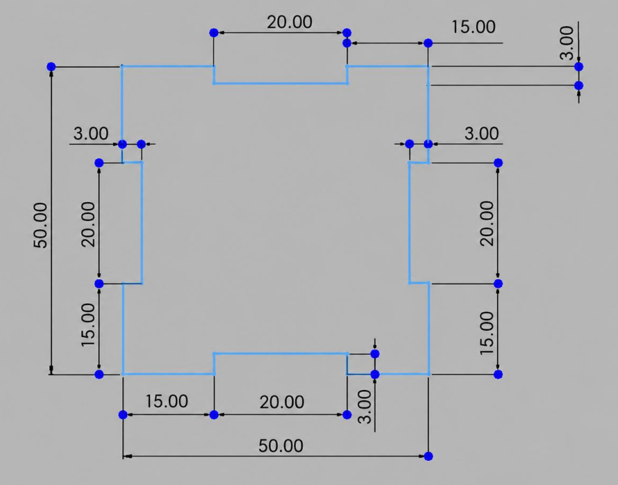
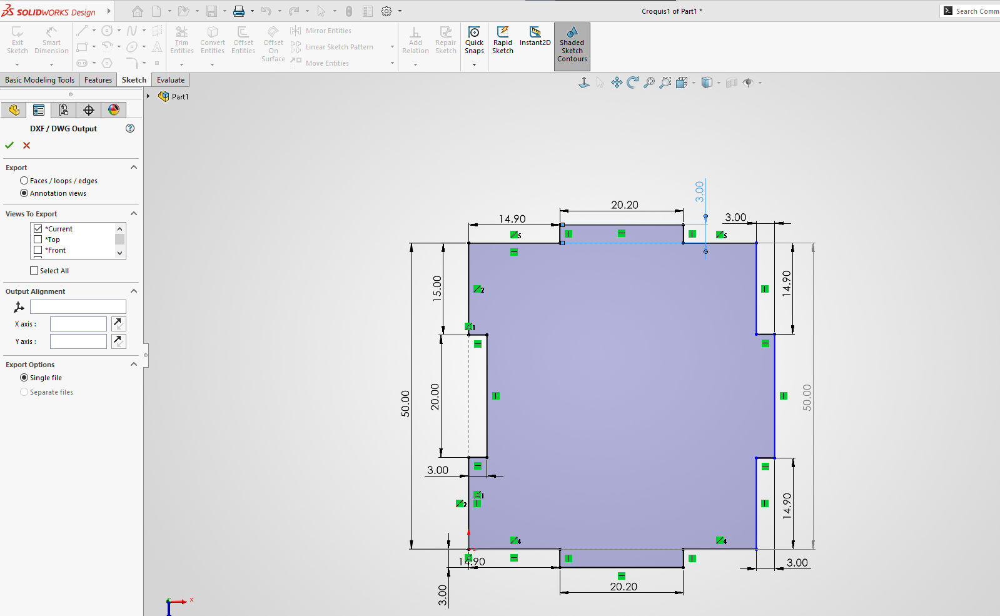

# Elaboración de un cubo 
## Semana 4

En esta práctica se utilizó el programa de SOLIDWORKS para realizar el modelado y diseño de un cubo que posteriormente fue fabricado con ayuda de una cortadora láser. El propósito principal de la práctica fue aprender a utilizar  SOLIDWORKS, conocer el proceso necesario para preparar un archivo para corte y comprender  el funcionamiento de la cortadora láser. El material utilizado para fabricar las piezas fue madera MDF, ya que es un material adecuado para este tipo de cortes y permite obtener piezas con buena precisión.

Primero se realizaron en SOLIDWORKS los diseños de cada una de las caras que formarían el cubo, considerando sus medidas y la manera en la que las piezas se unirían entre sí. Una vez terminado el diseño, fue necesario preparar el archivo para poder utilizarlo en el equipo de corte. Para esto, el diseño se exportó en formato DXF, ya que este formato permite conservar las líneas y dimensiones necesarias para realizar el corte.

<em>Figura 1. Modelado de las Tapas (se cortaon 2 iguales).</em>

<em>Figura 2. Modelado de los Lados (se cortaon 4 iguales).</em>

Después, el archivo DXF se convirtió a PDF utilizando el convertidor , para tener un archivo compatible con el programa utilizado para mandar el diseño a la cortadora láser. Antes de realizar el corte se revisó que las medidas, las líneas y la escala fueran correctas para evitar errores al momento de fabricar las piezas.

Finalmente, el archivo se mandó al equipo de corte láser, donde se configuraron los parámetros necesarios dependiendo del material utilizado. La máquina realizó el corte de cada una de las piezas sobre la madera MDF siguiendo el diseño realizado previamente en SOLIDWORKS. Después de obtener todas las piezas, estas se ensamblaron para formar el cubo.

Esta práctica permitió conocer de manera más completa el proceso que existe desde realizar un diseño digital hasta convertirlo en una pieza física. También sirvió para aprender a trabajar con diferentes formatos de archivo, utilizar herramientas de diseño como SOLIDWORKS y conocer de manera práctica el funcionamiento y uso de la cortadora láser.