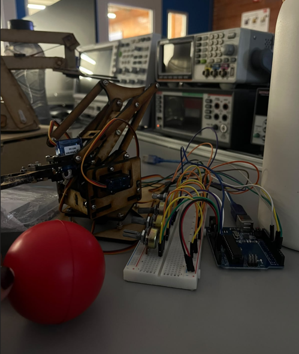
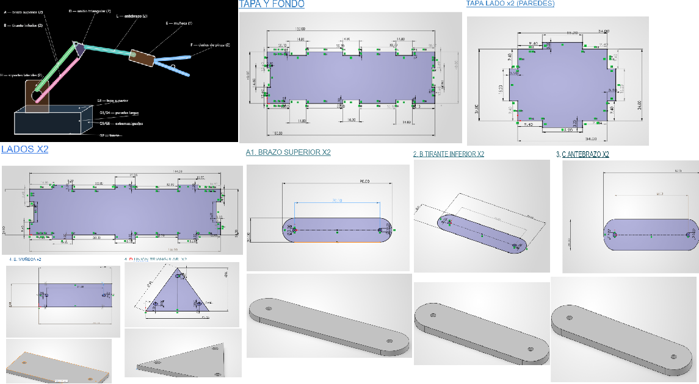
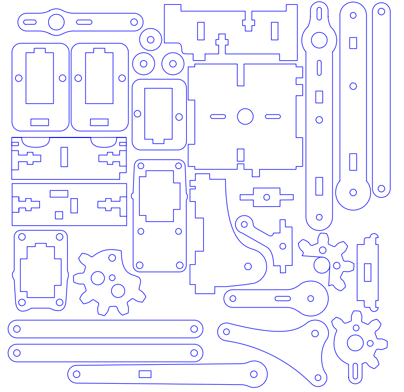
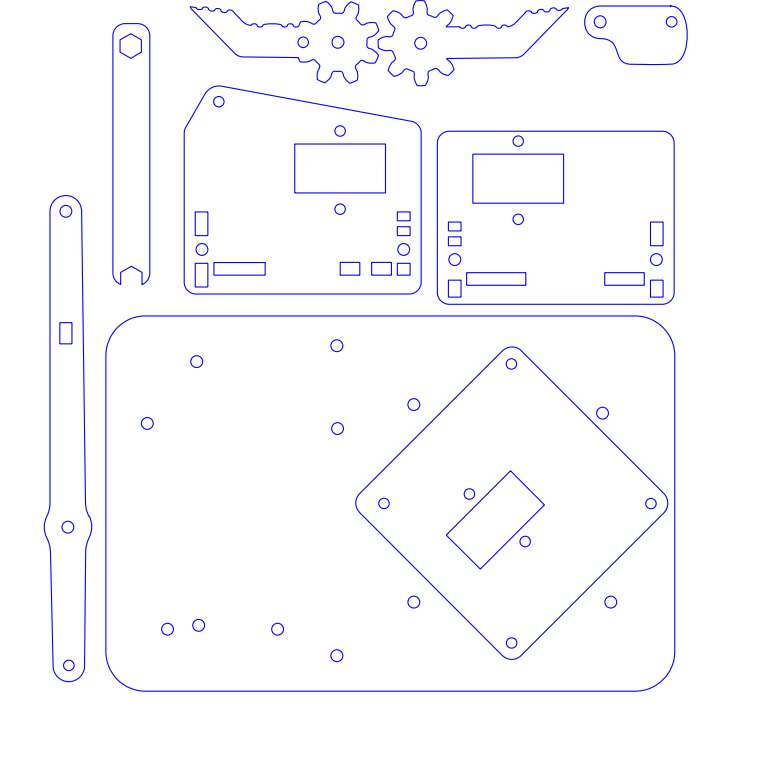

# Brazo Robot
## Semana 5 y 6 

En este proyecto se realizó un brazo robótico de 3 grados de libertad con una pinza, utilizando servomotores, Arduino y potenciómetros para controlar cada uno de sus movimientos.
El objetivo  del proyecto fue diseñar, construir y programar un brazo robótico capaz de moverse mediante potenciómetros y utilizar una pinza para tomar una pelota de aproximadamente de **6cm de diámetro**
La estructura del brazo se realizó utilizando **MDF de 3 mm**, cortado en la cortadora láser. También se realizaron las conexiones electrónicas necesarias para controlar los servomotores mediante un Arduino.

---

# Materiales

Los materiales utilizados para la realización del brazo robótico fueron:

| Material | Cantidad  | Uso |
|---|---:|---|
| Arduino | 1 | Controlar los servomotores y recibir la señal de los potenciómetros |
| Servomotores SG90 | 4 | Realizar los movimientos del brazo y de la pinza |
| Potenciómetros | 4 | Controlar manualmente la posición de cada servomotor |
| Protoboard | 1 | Realizar las conexiones del circuito |
| Cables jumper | Varios | Conectar los componentes |
| Cable USB A-B | 1 | Programar y alimentar el Arduino |
| MDF de 3 mm | Según diseño | Fabricar la estructura del brazo |
| Tornillos y tuercas | Varios | Unir algunas partes de la estructura |

<em>Materiales utilizados </em>

---

# Diseño del brazo

## Primer intento en SOLIDWORKS

Inicialmente se intentó realizar desde cero el diseño completo del brazo utilizando **SOLIDWORKS**.

La idea era diseñar cada una de las piezas de la estructura tomando en cuenta las medidas de los servomotores, los puntos de unión y el tamaño máximo permitido para el brazo.
Sin embargo, durante este proceso se presentaron varios problemas para conseguir que todas las piezas coincidieran correctamente entre sí y que el ensamble completo funcionara como se esperaba.

<em>Diseños de Solidworks.</em>

---

# Plantilla utilizada

Debido a que el diseño realizado inicialmente en SOLIDWORKS no funcionó como se esperaba, se utilizó una **plantilla externa** como base para fabricar las piezas del brazo.

La plantilla utilizada fue la siguiente:

<em>Figura 1. Plantillas de las piezas (parte 1) .</em>

<em>Figura 2. Plantillas de las piezas (parte 2) .</em>

**Instrucciones del armado :**  
[Ver Instrucciones](https://es.slideshare.net/slideshow/instrucciones-armarbrazorobotico/147417473#google_vignette)

La plantilla y las instrucciones sirvieron para poder juntar correctamente todas las piezas y facilitar el ensamble del brazo.

Antes de mandar las piezas a corte láser, el diseño se ajustó para trabajar con **MDF de 3 mm de grosor**, ya que este era el material disponible para realizar la estructura.

---

# Piezas del brazo

Las piezas fueron organizadas antes de realizar el corte para poder identificar posteriormente dónde iba colocada cada una.

En esta sección se muestran las diferentes piezas utilizadas para construir el brazo.

| Pieza | Descripción | Cantidad |
|---|---|---:|
| Pieza 1 | Base principal del brazo | 1 |
| Pieza 2 | Soporte de la base |  |
| Pieza 3 | Brazo inferior |  |
| Pieza 4 | Brazo superior |  |
| Pieza 5 | Soporte para servomotor |  |
| Pieza 6 | Soporte de la pinza |  |
| Pieza 7 | Pinza |  |
| Pieza 8 | Piezas de unión |  |

> **Nota:** La tabla se puede completar posteriormente con la cantidad y descripción exacta de cada pieza utilizada.

> **Espacio para imagen con todas las piezas**

<!-- Agregar aquí fotografía de todas las piezas -->

---

# Preparación para corte láser

Una vez que se tuvo el diseño final, las piezas se acomodaron para aprovechar de mejor manera el espacio disponible en la placa de MDF.
Se verificó que el archivo tuviera las dimensiones correctas y que estuviera preparado para trabajar con un material de **3 mm de grosor**.
Después se llevó el archivo a la cortadora láser para realizar el corte de cada una de las piezas.

**Video del corte:**  
<video width="700" controls>
  <source src="{{ 'assets/videos/03-arduino/04-brazorobot/cortadoralaser.mp4' | relative_url }}" type="video/mp4">
</video>

---
# Ensamble del brazo

Después de tener todas las piezas se comenzó con el ensamble del brazo robótico.

Primero se armó la base y posteriormente se fueron agregando los diferentes soportes, brazos y servomotores.

Durante el ensamble se tuvo que revisar constantemente que las piezas pudieran moverse libremente y que los servomotores no chocaran con la estructura.

Los servomotores SG90 fueron colocados en diferentes partes del brazo para controlar:

1. Movimiento de la base.
2. Movimiento del brazo inferior.
3. Movimiento del brazo superior.
4. Apertura y cierre de la pinza.

> **Espacio para fotografía del armado de la base**

<!-- Agregar aquí fotografía -->

> **Espacio para fotografía del brazo durante el ensamble**

<!-- Agregar aquí fotografía -->

> **Espacio para fotografía del brazo completamente ensamblado**

<!-- Agregar aquí fotografía -->

---

# Circuito electrónico

Para controlar el brazo se utilizó un **Arduino**, cuatro potenciómetros y cuatro servomotores SG90.

Cada potenciómetro se encarga de controlar un movimiento diferente del brazo. Al girar un potenciómetro, Arduino lee su valor y lo convierte en un ángulo que posteriormente se manda al servomotor correspondiente.

Las conexiones utilizadas fueron:

| Parte | Servo | Potenciómetro |
|---|---|---|
| Base | Pin digital 3 | A0 |
| Brazo inferior | Pin digital 5 | A1 |
| Brazo superior | Pin digital 6 | A2 |
| Pinza | Pin digital 9 | A3 |

El Arduino fue conectado mediante un **cable USB A-B**, utilizado tanto para cargar el programa como para realizar las primeras pruebas del circuito.

> **Espacio para imagen del circuito**

<!-- Agregar aquí fotografía o captura del circuito -->

> **Espacio para fotografía del circuito físico**

<!-- Agregar aquí fotografía del Arduino, protoboard y potenciómetros -->

---

# Programación

Para controlar los servomotores se utilizó la librería `Servo.h` de Arduino.

El programa lee el valor de cada potenciómetro utilizando las entradas analógicas del Arduino. Como los potenciómetros entregan valores entre 0 y 1023, estos valores se convierten a un rango aproximado entre 0° y 180° para controlar la posición de cada servomotor.

El código utilizado fue el siguiente:

